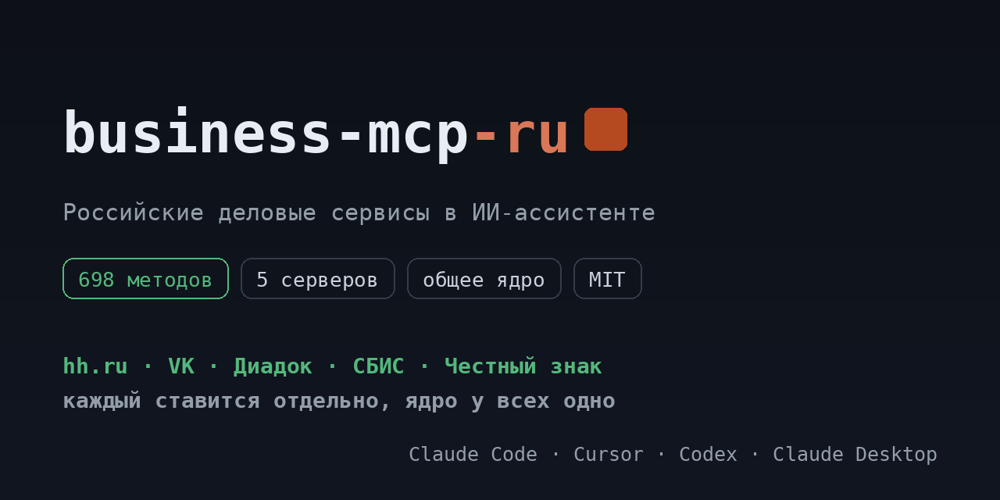

# business-mcp-ru

Пять MCP-серверов для российских деловых сервисов. Каждый живёт своим
репозиторием и ставится отдельно; здесь общий вход, страницы и список.

[](https://pypi.org/project/business-mcp-ru/)
[](https://github.com/ilyautov/business-mcp-ru/actions/workflows/ci.yml)
[](LICENSE)
[](#business-mcp-ru)
[](https://business-mcp-ru.aifrontier.tech/)
[](https://github.com/ilyautov/business-mcp-ru/stargazers)

<p align="center">
  <a href="https://business-mcp-ru.aifrontier.tech/">
    
  </a>
</p>

| репозиторий | сервис | методов | спрос/мес | страница |
|---|---|---|---|---|
| [chestny-znak-mcp-ru](https://github.com/ilyautov/chestny-znak-mcp-ru) | API Честного знака (ГИС МТ) | 33 | 1 976 | [chestny-znak-api](https://business-mcp-ru.aifrontier.tech/chestny-znak-api.html) |
| [diadoc-mcp-ru](https://github.com/ilyautov/diadoc-mcp-ru) | API Диадока (Контур) | 114 | 1 740 | [diadoc-api](https://business-mcp-ru.aifrontier.tech/diadoc-api.html) |
| [vk-mcp-ru](https://github.com/ilyautov/vk-mcp-ru) | VK API | 373 | 1 344 | [vk-api](https://business-mcp-ru.aifrontier.tech/vk-api.html) |
| [hh-mcp-ru](https://github.com/ilyautov/hh-mcp-ru) | API hh.ru | 133 | 911 | [hh-api](https://business-mcp-ru.aifrontier.tech/hh-api.html) |
| [sbis-mcp-ru](https://github.com/ilyautov/sbis-mcp-ru) | API СБИС (Saby) | 45 | 877 | [sbis-api](https://business-mcp-ru.aifrontier.tech/sbis-api.html) |
| [marketplaces-mcp-ru](https://github.com/ilyautov/marketplaces-mcp-ru) | Wildberries, Ozon, Яндекс Маркет, Авито | 1 022 | 6 503 | [marketplaces-mcp-ru.aifrontier.tech](https://marketplaces-mcp-ru.aifrontier.tech/) |

Всего 698 методов в пяти серверах отсюда, плюс 1 022 в маркетплейсах.

Последняя строка это отдельный проект: он старше, ставится одним пакетом сразу
на четыре площадки, и спрос в его строке это сумма по ним. Здесь же каждый
сервис ставится сам по себе.

## Поставить без терминала

У каждого сервера на странице релизов лежит файл `.mcpb`: скачайте и откройте
двойным щелчком. Claude Desktop поставит расширение сам и спросит ключи в
отдельном окне.

| сервер | бандл |
|---|---|
| hh.ru | [hh-mcp-ru/releases](https://github.com/ilyautov/hh-mcp-ru/releases/latest) |
| VK | [vk-mcp-ru/releases](https://github.com/ilyautov/vk-mcp-ru/releases/latest) |
| Диадок | [diadoc-mcp-ru/releases](https://github.com/ilyautov/diadoc-mcp-ru/releases/latest) |
| СБИС | [sbis-mcp-ru/releases](https://github.com/ilyautov/sbis-mcp-ru/releases/latest) |
| Честный знак | [chestny-znak-mcp-ru/releases](https://github.com/ilyautov/chestny-znak-mcp-ru/releases/latest) |

## Поставить один

```bash
uvx hh-mcp-ru          # или vk-mcp-ru, diadoc-mcp-ru, sbis-mcp-ru, chestny-znak-mcp-ru
```

## Поставить все пять

```bash
pip install business-mcp-ru
```

Этот пакет не содержит кода: он тянет пять серверов как зависимости, чтобы не
перечислять их по одному.

## Как устроено

Сервер это каталог методов (`endpoints.yaml`) плюс тонкий `server.py` на 66
строк. Всё остальное в общем ядре [schema-mcp-core](https://github.com/ilyautov/schema-mcp-core):
HTTP-клиент с авторизацией и повтором на 429, классы доступа, хранилище ключей,
`doctor`. Поэтому правка безопасности чинит сразу пять серверов, а не один.

Агент не получает сотню функций: он ищет метод словами (`*_search_methods`),
читает описание с параметрами (`*_describe_method`) и вызывает
(`*_call_method`). Перед записью спрашивает.

## Ключи

Живут на машине пользователя, в `~/.ru-mcp/cabinets.json` с правами 600. Наружу
не уходят: у каждого сервера белый список доменов, и заголовок авторизации не
покидает домен сервиса даже при вызове произвольного пути.

## Спрос

Цифры в таблице это Яндекс Вордстат, Россия, месяц до 08.09.2026, запрос вида
«<сервис> api». Ниши выбирались по двум условиям сразу: спрос от 800 в месяц и
отсутствие поддерживаемого MCP-сервера на GitHub. Замер и метод:
`Projects/nishi-mcp-skills-2026-09-11`.

## Страницы

`docs/` собирается скриптом из тех же каталогов, которые исполняют серверы:

```bash
python3 scripts/build_pages.py           # пересобрать
python3 scripts/build_pages.py --check   # сверить, для CI
```

Каталоги берутся из соседних папок репозиториев, а если их нет, из
установленных пакетов.

## Кто это сделал

[Илья Утов](https://github.com/ilyautov), лаборатория
[AI Frontier](https://aifrontier.tech). Как эти инструменты устроены внутри,
пишу в [Telegram](https://t.me/gorilla_under_hood) и
[LinkedIn](https://www.linkedin.com/in/ilyautov).

Рядом стоят [**marketplaces-mcp-ru**](https://github.com/ilyautov/marketplaces-mcp-ru)
(Wildberries, Ozon, Яндекс Маркет, Авито),
[**moysklad-mcp-ru**](https://github.com/ilyautov/moysklad-mcp-ru) и
[**humanizer-ru**](https://github.com/ilyautov/humanizer-ru).

Все проекты одним списком, разобранные по назначению:
[ilyautov.github.io](https://ilyautov.github.io/).

MIT.
